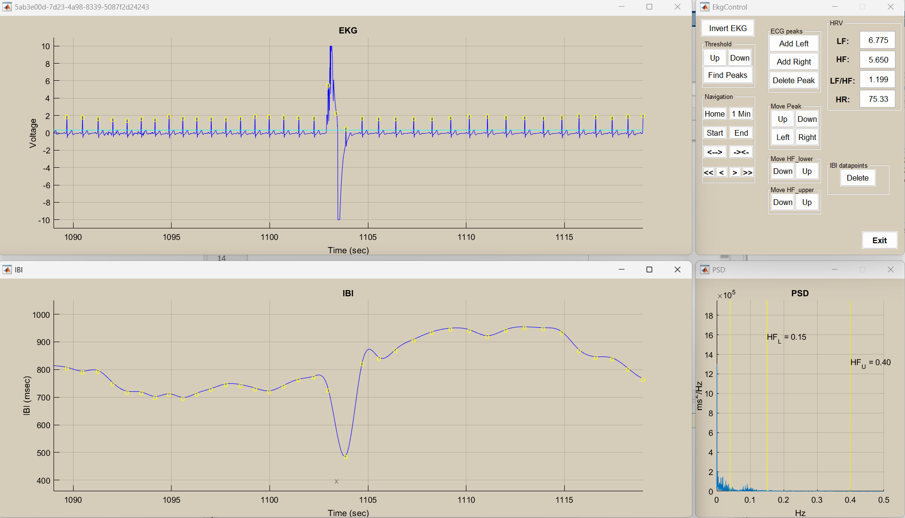
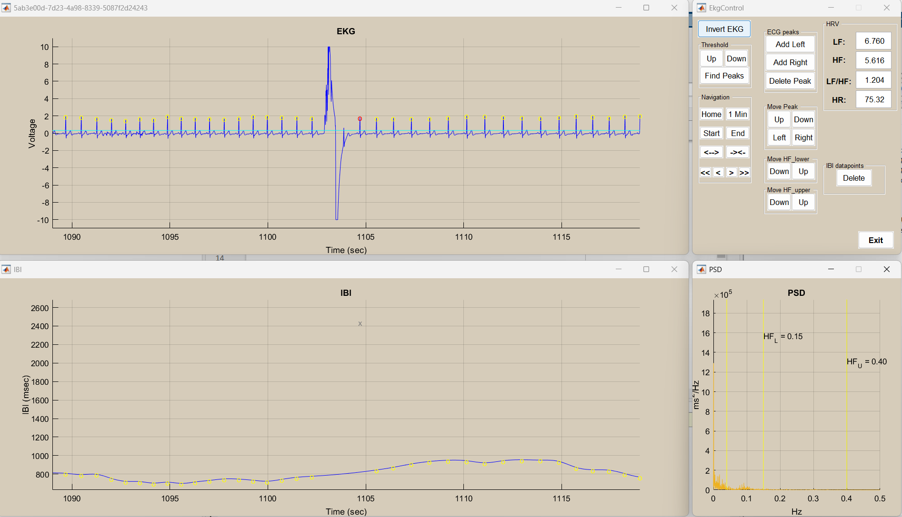
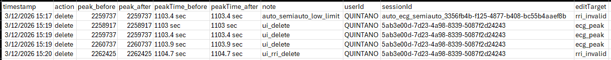

# PreprocessingPipeline

MATLAB preprocessing pipeline for BIOPAC `.acq` files (ECG and EDA).

<!-- This README focuses on:
- running the pipeline from `scriptEntryPoint.m`
- controlling `Participant.runPreprocessing(...)` arguments
- understanding ECG artifact rejection and resume behavior
- understanding output naming and where files are written -->

## Quick Start

1. Open MATLAB with this repository as current directory.
2. Open `scriptEntryPoint.m`.
3. Edit at least:
   - `participantDirPath` pointing to the directory that contains all the raw `.acq` files 
   - `taskSegmentation` to the task/event mapping
4. Run:

```matlab
scriptEntryPoint
```

`scriptEntryPoint.m` is used as the batch entrypoint (loop over `.acq` files in `participantDirPath`).

## What To Edit First In scriptEntryPoint

Start with these variables in `scriptEntryPoint.m`:

```matlab
participantDirPath = "C:\...\0-Data\1-RawData";

taskSegmentation = struct( ...
    'name',   {'Phase1','Phase2','Phase3'}, ...
    'events', {{ {code1,code2,code3} }, { {code1,code2,code3} }, { {code1,code2,code3,code4} }} );
```

Then tune `runPreprocessing(...)` arguments for the run:

```matlab
participant.runPreprocessing( ...
    save=true, ...
    ecgArtifactRejectionMethod="manual", ...
    taskSegmentation=taskSegmentation, ...
    sourcesToExtract=["ECG","EDA"]);
```

## Pipeline Controls (`Participant.runPreprocessing`)

Current supported name-value arguments are:

- `save` (default `true`)
- `ecgArtifactRejectionMethod` (default `"trim"`)
- `ecgQCSaveDir` (default `""`)
- `taskSegmentation` (default `struct('name', {}, 'events', {})`)
- `sourcesToExtract` (default `{"ECG","EDA"}`)

### `save` behavior (full control)

`save` controls which outputs are written.

#### Accepted forms

```matlab
save=true                      % all outputs (old behavior)
save=false                     % save nothing
save="epoched"                 % only epoched data
save="full"                    % only non-segmented full recording data
save="features"                % only HRV features
save=["epoched","features"]    % selected subset
save=struct('epochedData',true,'nonSegmentedData',false,'features',true)
```

#### Important current behavior

- If at least one save output is enabled and `ecgQCSaveDir` is empty, QC logs default to participant save dir.
- If `save` disables all outputs, current code clears `ecgQCSaveDir` and does not persist QC logs.

## Task Segmentation And Sources

### `taskSegmentation` structure

Use a struct array with fields:
- `name`: task label used in saved filenames
- `events`: cell-wrapped event IDs

Working pattern (matches current implementation):

```matlab
taskSegmentation = struct( ...
    'name',   {'P1','P2','P3','GNG'}, ...
    'events', {{ {13,14,15} }, { {23,24,25} }, { {33,34,35,36} }, { {105,106,107} }} );
```

`events` is expected as a cell container; the code reads `events{1}` and supports numeric arrays or cell arrays of numeric IDs inside.

### Where event IDs come from

TTL code maps live in:
- `utils/panda_ttl_codes.csv`
- `utils/roses_ttl_codes.csv`

These are used by `ACQParser` to label TTL events.

### `sourcesToExtract`

Typical values:

```matlab
sourcesToExtract=["ECG","EDA"]
sourcesToExtract=["ECG"]
```

Current behavior:
- requested source names are normalized to uppercase
- if a requested channel is missing in the ACQ file, the pipeline warns and skips that source

## How Participant ID Is Read From Filename

`Participant` infers experiment type from the ACQ filename stem and extracts ID accordingly.

- PANDA filename pattern: numeric only (`^\d+$`)
  - example: `440428.acq` -> participant ID `440428`
- ROSES filename pattern: `^\d+_.*_S\d+$`
  - example: `102_MP_Physio_S1.acq` -> participant ID `102`
- if filename matches neither pattern, preprocessing throws an error (`inferExperiment:UnknownPattern`)

## ECG Artifact Rejection (Deep Dive)

Implemented in:
- `utils/ECG.m`
- `utils/ECGRriArtifactRejectionService.m`

### Methods

- `trim`: cap RRI values outside limits
- `ignore`: alias of `drop`
- `drop`: remove out-of-range RRIs
- `manual`: interactive ECG peak/RRI review UI
- `semiauto`: auto-flag invalid RRIs, then interactive review UI

### Main ECG-related arguments in pipeline

- `ecgArtifactRejectionMethod`
- `ecgQCSaveDir`

Current default resume behavior is `resumeIfExists=true` inside the artifact rejection service.
In current `Participant.runPreprocessing(...)`, `resumeIfExists` is not exposed as a user argument and therefore remains at its default behavior.

### QC logs, location, and resume

QC directory:

```text
<participantSaveDir>/qc/ecgReview/
```

Actively persisted in:
- `edit_logs.csv`

Resume behavior:
- manual and semiauto review load prior `edit_logs.csv` when present
- resume reconstruction is driven from edit history

## Data Input And Output Conventions

### Input data

- Input is BIOPAC `.acq` files in `participantDirPath`.
- ACQ reading is handled by `utils/matlabBioread` via `biopacReader`.

### Output root directory

For each participant file, output is written next to raw data directory:

```text
<rawDataDir>/../DataProcessed/ByParticipant/<participantId>/
```

If the raw data is:

```text
.../0-Data/1-RawData/
```

then outputs go under:

```text
.../0-Data/DataProcessed/ByParticipant/<participantId>/
```

### File naming (`NameSchema`)

Current filename schema:

```text
{participantId}_{dataType}_{taskName}[_tpBin_{idx}|_tBin_{idx}].ext
```

Examples:
- `123456_RRI_P1.parquet`
- `123456_EDA_GNG_tpBin_003.parquet`
- `123456_RRI_fullRecording.parquet`
- `123456_HRV_baseline.parquet`
- `123456_HRV_epoch.parquet`

Notes:
- full non-segmented saves use task name `fullRecording`
- HRV saves use task names `baseline` and `epoch`
- default writer mode is parquet (`.parquet`) unless save mode is changed in writer APIs

## Dependencies And Attribution

### Required MATLAB-path dependencies

- `pan_tompkin.m` (ECG peak detection)
- Ledalab (EDA preprocessing)
- parquet support (`parquetwrite`) when saving parquet

### Bundled in this repository

- `utils/matlabBioread/` is included and used directly by the pipeline
- this is a MATLAB adaptation of the Python `bioread` project flow
- license and attribution files are included at:
  - `utils/matlabBioread/LICENSE`
  - `utils/matlabBioread/COPYRIGHT`

## TTL Codes Reference

TTL reference files are in `utils/`:
- `utils/panda_ttl_codes.csv`
- `utils/roses_ttl_codes.csv`

Use these when defining `taskSegmentation` event IDs.

## ECG Manual Review GUI

Before removal:

After removal:

Generated QC Log: 
